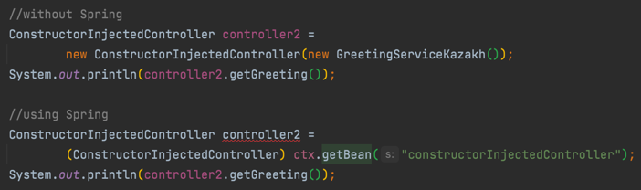

# Spring Concepts

### Dependency Injection (DI) using spring

1. We put @Controller annotation (it extends from @Component), so Spring retrieve bean.  
2. We put @Autowired annotation to injected class, so Spring will inject it when created object from main class.
3. We put @Service annotation to implemented class (from interface), so Spring know which implementation to use while injecting